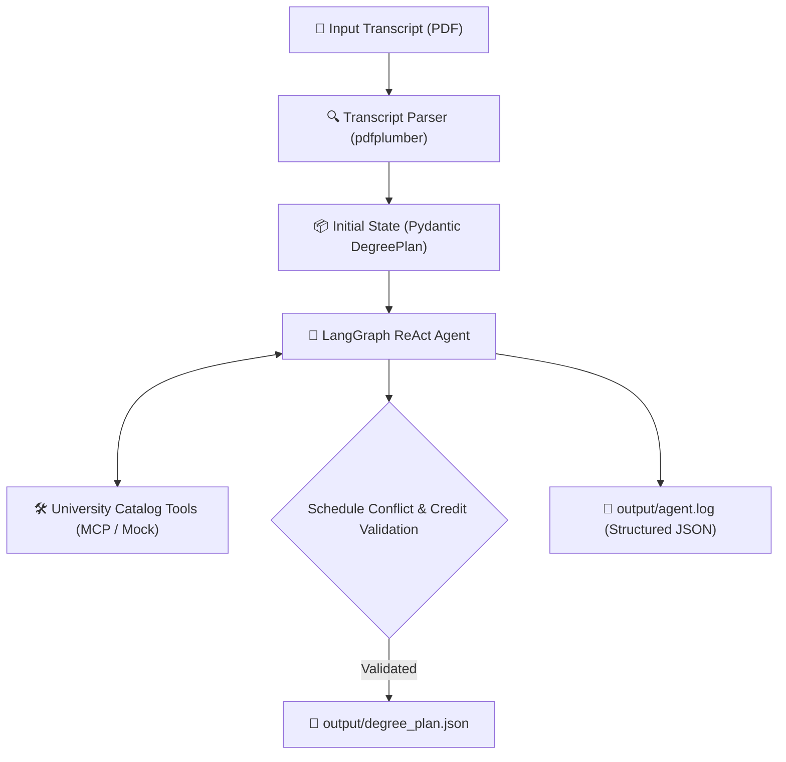

# DegreePilot: Autonomous AI Degree Planning Assistant

DegreePilot is an autonomous AI agent for academic degree planning built with **LangGraph**, **Pydantic**, **pdfplumber**, and **Loguru**. It parses student transcripts from PDF, reasons through course prerequisites and degree requirements in a ReAct loop, checks for credit limits and schedule time conflicts, and outputs a validated degree plan.

---

## 🏗️ Architecture Overview



---

## 🚀 Quickstart Guide (Docker Only)

### 1. Clone the Repository
```bash
git clone https://github.com/vikram0678/DegreePilot.git
cd DegreePilot
```

### 2. Configure Environment (Optional)
The default configuration is ready out-of-the-box. If using custom LLM endpoints or Anthropic API, edit `.env`:
```bash
cp .env.example .env
```

### 3. Run Degree Planning Assistant
Run the entire application with a single command:
```bash
docker compose up --build --abort-on-container-exit
```

**What this does automatically:**
1. Starts the **Ollama** service and waits for healthcheck readiness.
2. Launches the **DegreePilot App** container.
3. Ingests `./data/sample_transcript.pdf` and extracts completed coursework.
4. Runs the LangGraph ReAct planning loop.
5. Saves the validated degree plan to `output/degree_plan.json`.
6. Records all execution events to `output/agent.log`.
7. Shuts down containers cleanly upon completion.

---

## 🧪 Running Tests (Docker)

### Run Unit Test Suite
Verify model validators, credit limit checks, and schedule overlap detection:
```bash
docker compose run --rm app pytest test_models_and_parser.py -v
```

### Test Hard Step Limit (Requirement 6)
Verify loop termination and structured warning logging:
```bash
docker compose run --rm -e AGENT_MAX_STEPS=2 app python main.py
```

### Run with Custom Goal or Transcript
```bash
docker compose run --rm app python main.py --transcript ./data/sample_transcript.pdf --goal "Plan my next two semesters to finish the AI minor."
```

---

## 📁 Output Artifacts

| Output File | Description |
|---|---|
| [`output/degree_plan.json`](output/degree_plan.json) | Validated degree plan matching the required Pydantic JSON schema. |
| [`output/agent.log`](output/agent.log) | Single-line JSON log stream recording tool decisions and step executions. |

---

## 📂 Project Structure

```text
DegreePilot/
├── data/
│   ├── sample_transcript.pdf     # Sample student transcript
│   └── create_sample_pdf.py      # Transcript PDF generator
├── output/
│   ├── agent.log                 # Single-line structured JSON logs
│   └── degree_plan.json          # Serialized degree plan
├── models.py                     # Pydantic schemas & conflict validator
├── parser.py                     # pdfplumber transcript extractor
├── tools.py                      # Course catalog retrieval tools
├── agent.py                      # LangGraph ReAct state workflow
├── main.py                       # CLI application entry point
├── test_models_and_parser.py     # Unit test suite
├── Dockerfile                    # Application container
├── docker-compose.yml            # Multi-container orchestration
├── .dockerignore                 # Docker context ignore rules
├── requirements.txt              # Python dependencies
├── .env.example                  # Environment configuration template
└── README.md                     # Documentation
```

---

## 📄 License
This project is licensed under the [MIT License](LICENSE).
